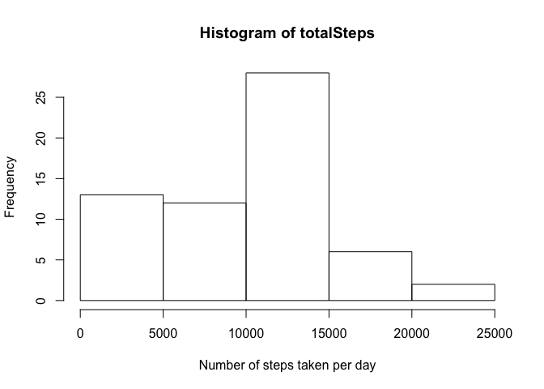
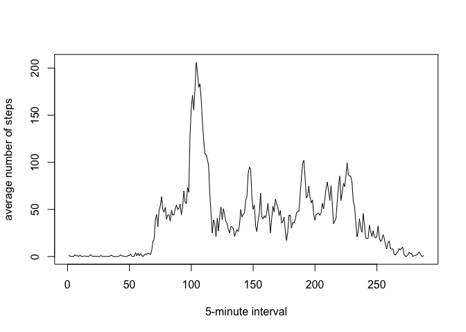
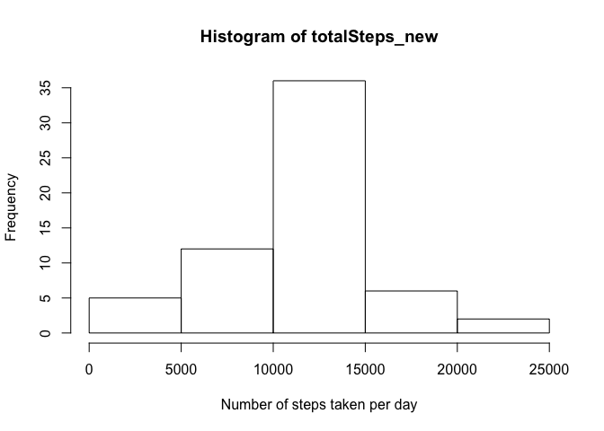
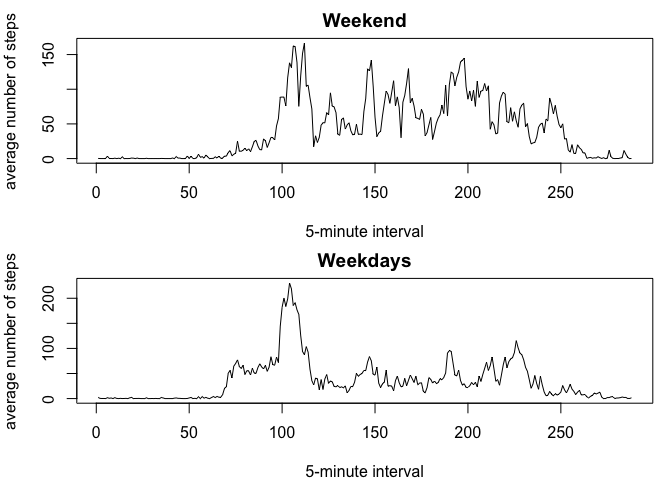

# Reproducible Research: Peer Assessment 1


## Loading and preprocessing the data

```r
unzip("activity.zip", exdir="./")
DT <- read.csv("activity.csv")
DT$date <- as.POSIXct(DT$date,format="%Y-%m-%d")
totalSteps <- tapply(DT$steps, DT$date,sum, na.rm =T)
png(filename = "./instructions_fig/hist_na.rm.png",  
    width = 480, height = 480, units = "px", bg = "white")
hist(totalSteps, xlab = "Number of steps taken per day")
dev.off()
```

```
## quartz_off_screen 
##                 2
```

```r
hist(totalSteps, xlab = "Number of steps taken per day")
```

 

## What is mean total number of steps taken per day?


```r
mean(totalSteps)
```

```
## [1] 9354.23
```

```r
median(totalSteps)
```

```
## [1] 10395
```

## What is the average daily activity pattern?

Here the time series plot of the 5-minute interval vs the average number of steps
taken, average across all days is given. 


```r
aveStepsInterval <- tapply(DT$steps, DT$interval, mean, na.rm = T)

png(filename = "./instructions_fig/timeseriesplot_na.rm.png",  
    width = 480, height = 480, units = "px", bg = "white")
plot(aveStepsInterval, 
     type ="l",
     xlab = "5-minute interval",
     ylab = "average number of steps")
dev.off()
```

```
## quartz_off_screen 
##                 2
```

```r
plot(aveStepsInterval, 
     type ="l",
     xlab = "5-minute interval",
     ylab = "average number of steps")
```

 
The maximum average step happens for the following interval value.

```r
which(aveStepsInterval==max(aveStepsInterval))
```

```
## 835 
## 104
```

## Imputing missing values
       The total number of missing data is:

```r
nrow(DT[DT$steps=="NA",])
```

```
## [1] 2304
```

Substituting "NA" with the average value of the associated interval averaged
over days, aveStepsInterval, definced above. A new data set made this way is given by: 


```r
DT_new <- DT
for(i in 1:nrow(DT_new)){
       if(is.na(DT_new[i,1])){
              DT_new[i,1] <- aveStepsInterval[[as.character(DT_new[i,3])]]}
       }
```

Histogram for total number of steps taken each day for the new data:


```r
totalSteps_new <- tapply(DT_new$steps, DT_new$date,sum)
png(filename = "./instructions_fig/hist_na_substituted.png",  
    width = 480, height = 480, units = "px", bg = "white")
hist(totalSteps_new, xlab = "Number of steps taken per day")
dev.off()
```

```
## quartz_off_screen 
##                 2
```

```r
hist(totalSteps_new, xlab = "Number of steps taken per day")
```

 
The mean and median of the new data as shown below are different from the one calulcated by removing NA. Imputting missing data increases the average value of 
both the mean and the median of the steps taken:


```r
mean(totalSteps_new)
```

```
## [1] 10766.19
```

```r
median(totalSteps_new)
```

```
## [1] 10766.19
```

## Are there differences in activity patterns between weekdays and weekends?

Creating a new vector of factor type that identifies the dates of the data as 
"weekend" or "weekday" and adding it as a fourth column.


```r
week_id <- function(x){
       if(weekdays(x)=="Sunday" | weekdays(x)=="Saturday") {"weekend"}
       else{"weekday"}
       }
f <- as.factor(sapply(DT_new$date, week_id))

DT_new[,4] <- f
names(DT_new)[[4]] <- "date_id"

#weekend data
DT_new_wkd <-DT_new[DT_new["date_id"]=="weekend",]
aveStepsInterval_wkd <- tapply(DT_new_wkd$steps, DT_new_wkd$interval, mean)

#weekday data
DT_new_wk <-DT_new[DT_new["date_id"]=="weekday",]
aveStepsInterval_wk <- tapply(DT_new_wk$steps, DT_new_wk$interval, mean)

# joined data frame

DT_new1 <- data.frame(inter=names(aveStepsInterval_wkd),
                      ave=as.vector(aveStepsInterval_wkd),
                      week_id="weekend")
DT_new2 <- data.frame(inter=names(aveStepsInterval_wk),
                      ave=as.vector(aveStepsInterval_wk),
                      week_id="weekday")
aveStep <- rbind(DT_new1, DT_new2)
row.names(aveStep) <- 1:576
```

Plotting to see if weekend is different from weekday for average steps.


```r
png(filename = "./instructions_fig/timeseries_panel.png",  
    width = 480, height = 480, units = "px", bg = "white")
par(mfrow = c(2, 1), mar = c(4, 4, 2, 1), oma = c(0, 0, 0, 0)) 
plot(aveStepsInterval_wkd, 
     type ="l",
     xlab = "5-minute interval",
     ylab = "average number of steps",
     main = "Weekend")
plot(aveStepsInterval_wk, 
     type ="l",
     xlab = "5-minute interval",
     ylab = "average number of steps",
     main = "Weekdays")

dev.off()
```

```
## quartz_off_screen 
##                 2
```

```r
par(mfrow = c(2, 1), mar = c(4, 4, 2, 1), oma = c(0, 0, 0, 0)) 
plot(aveStepsInterval_wkd, 
     type ="l",
     xlab = "5-minute interval",
     ylab = "average number of steps",
     main = "Weekend")
plot(aveStepsInterval_wk, 
     type ="l",
     xlab = "5-minute interval",
     ylab = "average number of steps",
     main = "Weekdays")
```

 


The above plots show that the average steps for the weekend and the weekday are different with the maximum being higher for the weekdays .
